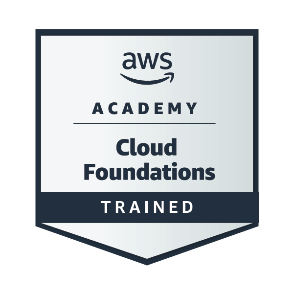

# 👋 Hello there! I'm **Tain Yan Tun** (𝐃𝐄𝐑𝐄𝐊)

---

## 🚀 About Me

I am an undergraduate Senior pursuing a Bachelor of Science in Information Technology, specializing in full-stack software development, data engineering pipelines, and data science methodologies.

### 💡 What I'm up to: 
- 🛠️ **Data Engineering:** Main focus - In process of mastering relational databases, query optimization, data modeling, and shell scripting.
- 🔬 **Data Science & Research:** Modeling geospatial, event, and demographic datasets for machine learning and quantitative research
- ⚙️ **Full-Stack Development:** Architecting fast, minimalist interfaces using Next.js and TypeScript for various system
- 👯 **Collaboration:** Open to collaborating on open-source data tools, hackathons, and backend/data architecture projects.

<table align="left">
  <tr>
    <td align="center" width="200">
      
       
      <b>Google Data Analytics</b>
    </td>
    <td align="center" width="200">
      
       
      <b>GitHub Foundations</b>
    </td>
    <td align="center" width="200">
      
       
      <b>AWS Cloud Foundation</b>
    </td>
  </tr>
</table>

 

---

### 🛠️ Tech Stack (Tools & Libraries Included)
 

---

## 🤝 Let's Connect

Open to professional connections, open-source collaborations, or discussions on data systems and architecture.

---

## ☕ Support My Work

If you find my projects helpful or interesting, consider supporting my work!

---

*Thanks for visiting my profile! Happy coding for everyone who check this read.me! 🚀*
